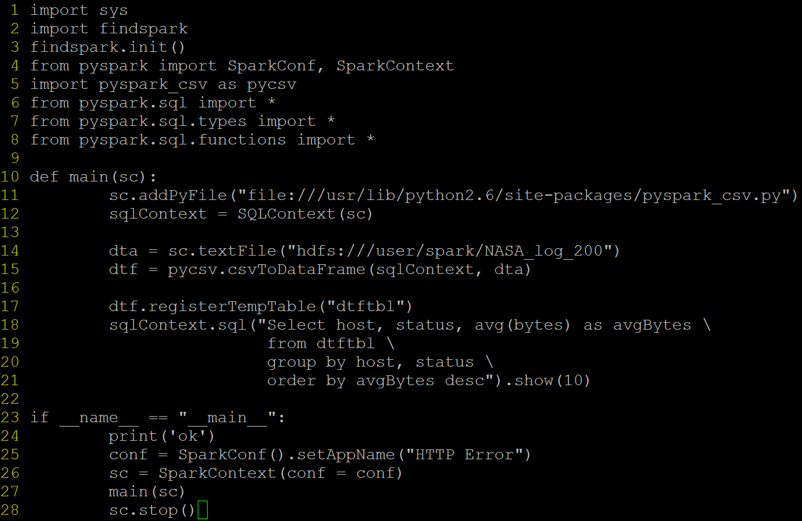
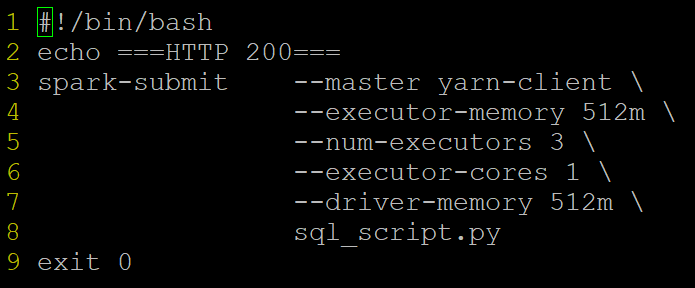

# Transforming a Log File for Further Processing
# Topics <a name='top'></a>
- [Pre-Requisites](#prereq)
- [Dataset](#dataset) 
- External PySpark Modules
    - [pyspark_csv](#pyspark_csv)
- [PIG Scripts](#PIG)
    - define, split, CSVExcelStorage, CommonLoagLoader
- [spark-submit](#spark_submit)
    - [sql_script.py](#sql_script.py), [sql_script.sh](#sql_script.sh)
- [Readings](#hint)

## Prerequsites <a name='prereq'></a>
- In case you come across this error while importing pyspark 
```py
>>> import pyspark
Traceback (most recent call last):
  File "<stdin>", line 1, in <module>
ImportError: No module named pyspark
```
- make sure SPARK_HOME Environment Variable is set to correct path (according to your system, following is just an example)
```shell
[root@sandbox spark]# export SPARK_HOME=/usr/hdp/2.4.0.0-169/spark
[root@sandbox spark]# export PATH=$SPARK_HOME/bin:$PATH
```
- install find spark
```shell
pip install findspark
```
- import findspark
```py
>>> import findspark
>>> findspark.init()
>>> import pyspark
```
- install 
```shell
[root@sandbox data]# pip install python-dateutil
```
[Top](#top)
## Dataset & Preparation <a name='dataset'></a>
1. Download [NASA_access_log_Aug95.gz](http://www.ftpstatus.com/file_properties.php?sname=ftp.cs.umass.edu&fid=66) .
2. Copy it over into your Hadoop VM.
3. Unzip and ingest it into Hadoop, that is, move it to HDFS.
```shell
[root@sandbox data]# gunzip -f NASA_access_log_Aug95.gz
[root@sandbox data]# ls
NASA_access_log_Aug95
[root@sandbox data]# hadoop fs -put NASA_access_log_Aug95 /user/spark
[root@sandbox data]# hadoop fs -ls /user/spark
Found 1 item
-rw-r--r--   3 root hdfs  167813770 2020-03-09 14:36 /user/spark/NASA_access_log_Aug95
```

[Top](#top)
## External PySpark Modules <a name='pyspark_csv'></a>
4. Download [pyspark-csv-master](https://github.com/seahboonsiew/pyspark-csv)
5. Copy it over into your Hadoop VM.
6. Unzip and move pyspark_csv.py file to /usr/lib/python2.6/site-packages. Note that the archive creates its own directory when extracted.
    - verify the pyspark_csv.py file is in place using find command.
```shell
[root@sandbox data]# find / -name "pyspark_csv.py" 2>/dev/null
/usr/lib/python2.6/site-packages/pyspark_csv.py
```
7. ssh login to your HDP2.4 vm.
8. Use vi editor to write the scripts ! ! !
9. Have A Primer on Spark using Python document available for reference purposes. 

[Top](#top)
## PIG Scripts <a name='PIG'></a>
10. Create **split_log.pig** script which splits the log file into 3 based on http status codes. 
    - 
    - Pay particular attention to how the log file is loaded as log file and stored in csv format.
    - [CSVExcelStorage](https://pig.apache.org/docs/latest/api/org/apache/pig/piggybank/storage/CSVExcelStorage.html): CSV loading and storing with support for multi-line fields, and escaping of delimiters and double quotes within fields; uses CSV conventions of Excel 2007. 
    - [CommonLoagLoader](https://pig.apache.org/docs/r0.17.0/api/org/apache/pig/piggybank/storage/apachelog/CommonLogLoader.html): to load logs based on Apache's common log format, based on a format like LogFormat "%h %l %u %t \"%r\" %>s %b".
11. Display the contents of /user/spark in HDFS to see that there's only the log file stored in it.
```shell
[root@sandbox data]# hadoop fs -ls /user/spark
Found 1 item
-rw-r--r--   3 root hdfs  167813770 2020-03-09 14:36 /user/spark/NASA_access_log_Aug95
```
12. Run the script. Note how the messages are avoided using stderr redirection.
```shell
[root@sandbox data]# pig split_log.pig
```
13. Display the contents of /user/spark in HDFS to see the additional files. Note that the split creates directories and data is partitioned in these directories. This is transparent when using HDFS. You don't need to make any reference to these partitions directly in your pig and/or pyspark scripts.
```shell
[root@sandbox data]# hadoop fs -ls /user/spark
Found 4 items
-rw-r--r--   3 root hdfs  167813770 2020-03-09 14:36 /user/spark/NASA_access_log_Aug95
drwxr-xr-x   - root hdfs          0 2020-03-09 15:39 /user/spark/NASA_log_200
drwxr-xr-x   - root hdfs          0 2020-03-09 15:39 /user/spark/NASA_log_404
drwxr-xr-x   - root hdfs          0 2020-03-09 15:39 /user/spark/NASA_log_else
```
14. Display contents of part-m-00000 to see the header line and the csv format.
```shell
[root@sandbox data]# hadoop fs -cat /user/spark/NASA_log_200/part-m-00000 | head -n 20
host,method,status,bytes
in24.inetnebr.com,GET,200,1839
ix-esc-ca2-07.ix.netcom.com,GET,200,1713
slppp6.intermind.net,GET,200,1687
piweba4y.prodigy.com,GET,200,11853
slppp6.intermind.net,GET,200,9202
slppp6.intermind.net,GET,200,3635
ix-esc-ca2-07.ix.netcom.com,GET,200,1173
```

[Top](#top)
## spark-submit <a name='spark_submit'></a>
15. Using vi, prepare scripts
    - **sql_script.py**  <a name='sql_script.py'></a>
    -    
    - Note how pyspark_csv.py script is imported on line 5 and incorporated into SparkContext in line 12. 
    - Note how pyspark_csv.py creates a dataframe directly from a csv file with header. (Line 14, 15)
    
    [Top](#top)
    - **sql_script.py** <a name='sql_script.sh'></a>
    - 
    
    [Top](#top)
    - Inspect sql_script.sh script and see how sql_script.py script is submitted.
    - Also note that sql_script.sh script must have execute bit turned on.
    ```shell
    [root@sandbox data]# chmod 0700 sql_script.sh 
    ```
    - Execute **sql_script.sh**
```shell
[root@sandbox data]# ./sql_script.sh 2>/dev/null
===HTTP 200===
ok
spark.yarn.driver.memoryOverhead is set but does not apply in client mode.
+--------------------+------+---------+
|                host|status| avgBytes|
+--------------------+------+---------+
|kiosk-4-89.dial.i...|   200|1121554.0|
|      199.185.209.13|   200|1121554.0|
|   h97-125.ccnet.com|   200|1121554.0|
|tty10g.netropolis...|   200|1082916.0|
|      163.231.236.20|   200|1036266.0|
|dialin12.stdrem.o...|   200| 966656.0|
|dialup-1-3.gw.umn...|   200| 952257.0|
|      163.231.236.29|   200| 946425.0|
|dynam62.campusnet...|   200| 936810.0|
|      163.231.236.27|   200| 925696.0|
+--------------------+------+---------+
only showing top 10 rows
```

[Top](#top)

##  Hints <a name='hint'></a>
1. The original dataset is available at http://ita.ee.lbl.gov/html/contrib/NASA-HTTP.html . Visit this Webpage for dataset description.
2. Visit http://hadooptutorial.info/processing-logs-in-pig to learn how to load and process a log file in pig. Visit its homepage for other useful info.
3. Visit https://pig.apache.org for Pig project homepage and http://pig.apache.org/docs/r0.17.0 for Pig documentation.
4. Visit http://www.westwind.com/reference/OS-X/commandline/pipes.html, or https://www.tutorialspoint.com/unix/unix-pipes-filters.htm for I/O redirection and pipes in Unix/Linux/OSX.
5. Consult the Unix/Linux cheatsheets in the Course Shell.
6. Venerable vi editor ! Visit https://www.cs.colostate.edu/helpdocs/vi.html and https://engineering.purdue.edu/ECN/Support/KB/Docs/ViTextEditorTutorial .

[Top](#top)
